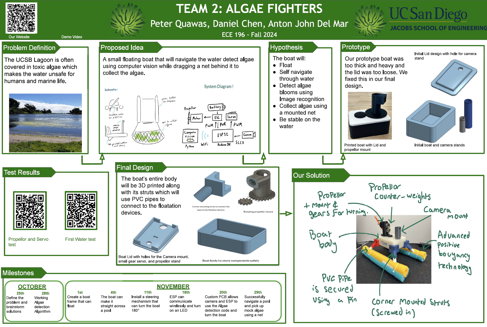

# ECE 196 Final Project - Algae Neutralizing Agent 

 

## Problem Definition 
Algae blooms can release toxins into the water and be deadly to the plant, animal, and human life that depends on that water supply. This can affect large bodies of water such as oceans and lakes, however, this issue also affects public water spaces like pools and reserves. 

In this project we developed a small scale solution that works in commerical pools, with hopes of eventually evolving into larger bodies of water. 

## Solution 
Our team created a small scale unmanned surface vehicle, which traverses the water and collects the toxic algae using a net. 

We first developed our state of the art floating mechanism, pool noodles! We created a simple frame in Autodesk Fusion, and utilized these floatation devices to keep our creation from sinking. 

Next we created our own custom ESP32 electronics shield using Altium. This shield served the power systems on board for our microcontroller and brushless motor, and it allowed us to control the servos that steer our USV. 

Finally we developed a simple HSV detection algorithm to identify algae, and used a proportional controller to steer the USV in it's direction for capture. 

## Team 
Daniel Chen, Peter Quawas, and Anton John Del Mar 

Thanks for all the hard work guys ! 